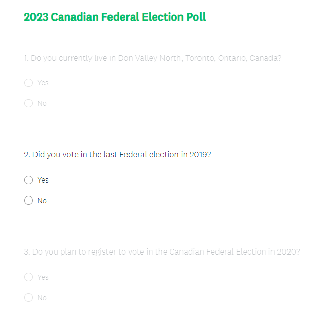
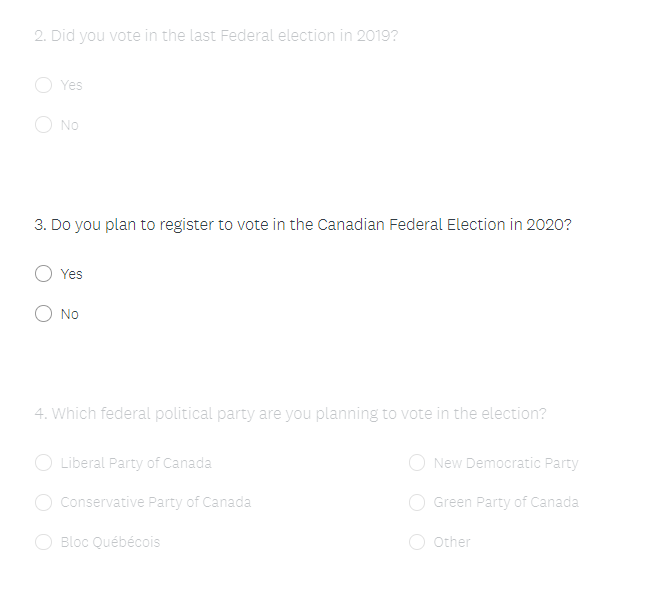
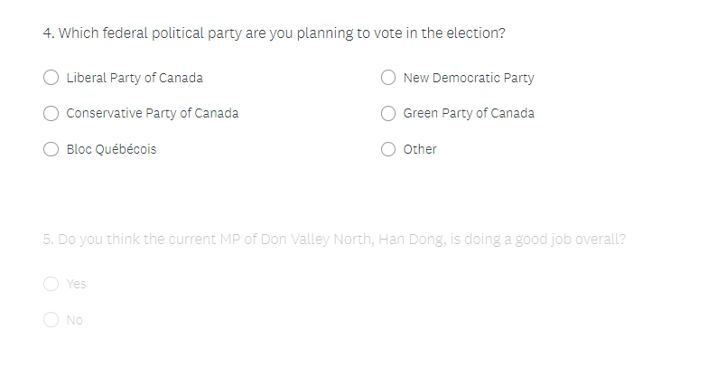
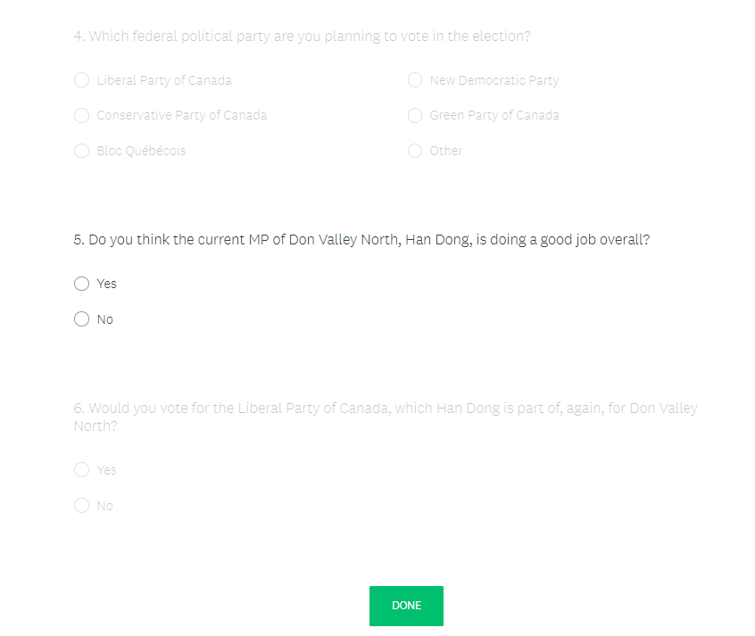
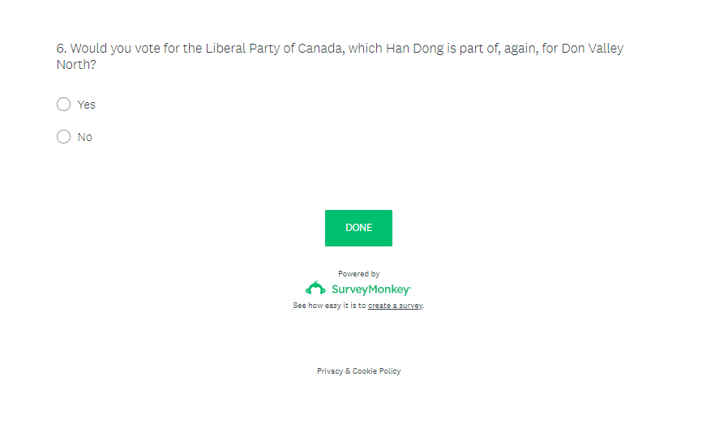

```{r setup, include=FALSE}
knitr::opts_chunk$set(echo = F, message=F, warning=F)
library(dplyr)
library(ggplot2)
library(scales)
library(knitr)
```

\newpage

# Executive summary

We conducted a political poll on the residents of the Don Valley North federal electoral district asking for their opinions on various topics related to the Don Valley North riding in the 2023 Canadian federal election. This poll was requested by the current Member of Parliament (MP) of Don Valley North in order to prepare for his political campaign for the 2023 election in advance. We used randomly sampled residents of Don Valley North and collected the poll data. After analyzing the results, we discovered approximately 50% of the sample indicated they would vote for the current MP again in 2023 and of these residents approximately 90% have been satisfied with his works so far. These results were deemed as both informative and beneficial to the overall governing strategy of the current MP in Don Valley North and the prepartion of his next election campaign. 

\newpage

# Introduction

Don Valley North is a federal electoral district in Toronto, Ontario, Canada. It has been represented in the House of Commons of Canada from 1988 to 1997 and after 2015. The Don Valley North federal district covers the area of the City of Toronto bounded by Steeles Avenue East to the north, Highway 401 to the south, Bayview Avenue to the west, and Victoria Park Avenue to the east [@citedon]. The current Member of Parliament of Don Valley North has requested a political opinion poll on the residents of Don Valley North on the 2023 Canadian federal election in order to prepare for his political campaign. In particular, in accordance with his request, we investigated the proportion of residents that would vote for him again in the 2023 federal election through survey design and sampling. We were also interested in other characteristics of our sampled residents including whether they voted in the 2019 federal election, whether they plan to vote in the 2023 election and how satisfied they are with the current MP. 

We used randomly sampled residents of Don Valley North using simple random sampling without replacement. We designed our election poll containing crucial information that could provide us with political opinion of the residents on the current MP and the 2023 Canadian federal election and the Don Valley North riding. We mailed them physical copies of our poll and provided incentives to avoid non-response. After we collected data from all sampled residents, we used data visualization methods to summarize the poll results and statistical techniques to estimate the proportion of interest and provide a margin of error on that estimate to quantify the uncertainty in the estimation procedure. We found that about 50% of the sample would vote for the current MP again in 2023 and of these about 90% have been satisfied with his works for the district. Our results show that the current MP only has a 50% chance of getting re-elected and so would need to increase his impact on and contributions to Don Valley North to obtain more support from its residents. This provides extraordinary insight to the current MP and will motivate him to up his game and do more for the residents of Don Valley North in the next few years before 2023. 

Our election poll design and analysis are subject to certain limitations. We did not pre-specify a desired error bound and calculate the required sample size to obtain it. Moreover, we could not assure the level of representative of our collected sample. We could have potentially missed certain groups of residents that might be very different from the rest of the residents of Don Valley North by certain characteristics such as age and social class. We also did not plan for any adjustments to the calculations when should there be non-response. 

\newpage

# Survey methodology

The objective of the survey is to estimate the proportion of resident of the Don Valley North electoral district that will vote for their current Member of Parliament again in the 2023 Canadian federal election. Relevant data to be collected include whether the respondent currently lives in Don Valley North, whether they voted in the 2019 federal election, whether they plan to vote in the 2023 federal election, which party they plan to vote for,  whether they are satisfied with the current MP and whether they would vote again for the current MP. The target population is Don Valley North residents who are eligible to vote. The frame is the list of all past registered voters in the City of Toronto database, specifically in the sub-list containing registered voters that reside in Don Valley North. The frame population is those on that list. The sampling population is those with a mailing address since the election poll would be mailed to their mailing address. The sample is those selected to have the poll mailed to them via the sampling procedure. 

The sampling procedure is simple random sampling without replacement (SRSWOR). This is a probability sampling technique in which each person in the population has an equal chance of being selected to be in the sample. Each person that gets selected would not have any chance to get selected again. This design is appropriate here because of its simplicity in both the physical sampling procedure and the statistical inference procedure. It has appealing properties such as being able to produce unbiased estimates and results. This design is appropriate here because the population size, which is the total population of Don Valley North, is relatively small on a national or provincial scale. 

Our target population which is the total eligible votes in Don Valley North in the 2019 Canadian federal election has a population size of 75,566, as reported in the 2016 Census of Population by Statistics Canada [@citecen]. We aimed to sample 2,000 residents from this population. We denote population size as $N$ and sample size as $n$. Under SRWOR, the probability of getting selected for any resident in this population is $\frac{1}{N}$. Our main variable of interest is whether the resident will vote for the current MP again for the Don Valery North riding in the 2023 Canadian federal election, denoted as $Y$. $Y$ is a binary variable with values that can either be 0 or 1, with 0 indicating the that the resident will not vote for the current MP again and 1 indicating the resident will vote for the current MP again. Our sample yields $y_1, \ldots, y_n$. The parameter of interest is the proportion of Don Valley North residents that would vote for the current MP again, denoted as $\mu_y$. We will use the same proportion in our selected sample, denoted as $\bar{y}$ and outlined in Equation \@ref(eq:mean), to estimate $\mu_y$. $\bar{y}$ has nice properties such as being unbiased ($E[\bar{y}]=\mu_y$) and having a variance that has an unbiased estimator. The unbiased estimator for the variance of $\bar{y}$ is Equation \@ref(eq:var). Equation \@ref(eq:s) is the sample variance of $y_1, \ldots, y_n$. 

\begin{equation}
\bar{y}=\frac{1}{n}\sum_{i=1}^ny_i(\#eq:mean)
\end{equation}

\begin{equation}
v(\bar{y})=(1-\frac{n}{N})(s^2_y/n)(\#eq:var)
\end{equation}

\begin{equation}
s^2_y = \frac{1}{n-1}\sum_{i=1}^n(y_i-\bar{y})^2(\#eq:s)
\end{equation}

The desired respondents will first be randomly selected from the sampling frame and mailed a physical copy of the designed election poll. After they filled out the poll they were asked to mail it back to our head office free of shipping charge. Their mailing address registered in the database will be used. The cost will be estimated to be \$2.00 CAD per person which includes printing fees, mailing fees, collection, shipping and sampling fees. The total cost amounts to \$4,000.00 for the whole sample. The election poll will be anonymous since it does not ask for the respondent's name in order to protect respondent privacy. Non-response data is expected and those who do not respond will be encouraged to respond with financial incentives, particularly coupons to our partnering local pizza joint that were donated to us generously to aid our campaign. The analysis of the survey data will have two components: data visualization and statistical inference. The answers to each question in the poll will be visualized to provide a visual summary of the trends and estimation and inference will be conducted for the main outcome of interest. 

We will use the `R` [@citer] statistical and programming software to conduct the analysis of the collected data.

\newpage

# Results

```{r}
N <- 75566 # population size
n <- 2000  # sample size
set.seed(123) # set random seed for reproducibility
# Generate population data
pop <- data.frame(live = rep(1, N),
                  vote_past = sample(c(0,1), replace=T, size=N, prob=c(1-46885/75566, 46885/75566)),
                  plan_vote = sample(c(0,1), replace=T, size=N, prob=c(1-62000/75566, 62000/75566)),
                  party = sample(c("Liberal", "Conservative", "NDP", "Green", "Other"),
                                    replace=T, size=N, prob=c(0.504, 0.354, 0.092, 0.039, 0.011)),
                  current_MP = sample(c(0,1), replace=T, size=N, prob=c(1-0.504, 0.504)),
                  vote_again = rep(0, N)
                  )

for (i in 1:nrow(pop)) {
  if (pop$current_MP[i] == 1) {
    pop$vote_again[i] <- sample(c(0,1), replace=F, size=1, prob=c(0.1, 0.9))
  } else {
      pop$vote_again[i] <- sample(c(0,1), replace=F, size=1, prob=c(0.9,0.1))
    }
}

# Data manipulation
pop <- pop %>% mutate(vote_past = ifelse(vote_past == 1, "Yes", "No"),
                      plan_vote = ifelse(plan_vote == 1, "Yes", "No"),
                      current_MP = ifelse(current_MP == 1, "Yes", "No"),
                      vote_again1 = ifelse(vote_again == 1, "Yes", "No"))
pop <- pop %>% mutate(vote_past = factor(vote_past, levels=c("Yes", "No")),
                      plan_vote = factor(plan_vote, levels=c("Yes", "No")),
                      current_MP = factor(current_MP, levels=c("Yes", "No")),
                      vote_again1 = factor(vote_again1, levels=c("Yes", "No")),
                      party = factor(party, levels=c("Liberal", "Conservative", "NDP", "Green", "Other")))

# generate sample from population using SRSWOR
samp <- pop[sample(1:N, n, replace = F), ]
```

We sampled 2,000 residents from the Don Valley North federal electoral district and all of them indicated that they are currently living in Don Valley North. Figure \@ref(fig:fig1) shows that a little over 60% of the sample voted in the 2019 federal election. Figure \@ref(fig:fig2) shows that a little over 80% of the sample are planning to vote in the 2023 election. Figure \@ref(fig:fig3) shows that a little over 50% of the sample are satisfied with the current MP of Don Valley North. Figure \@ref(fig:fig4) shows that approximately 50% of the sample would vote again for the current MP in 2023. Figure \@ref(fig:fig5) shows that approximately 90% of those who would vote for the current MP again have been satisfied with him and about 90% who would not vote for him have not been satisfied with him. Figure \@ref(fig:fig6) shows that the majority of the sample (close to 50%) intend to vote for the Liberal Party of Canada, approximately 37% for the Conservative Party of Canada, approximately 10% for the New Democratic Party of Canada, approximately 5% for the Green Party of Canada and less than 1% for other parties. 

```{r fig1, fig.cap="Proportion of sampled residents of Don Valley North who voted in the 2019 federal election."}
# bar graph showing proportion of sample who voted in the 2019 federal election
ggplot(samp, aes(x=vote_past))+
  geom_bar(aes(y = (..count..)/sum(..count..)), width=0.7, fill="steelblue", col="black")+
  theme_classic() + scale_y_continuous(labels = percent) + 
  labs(y="", x="", 
       title="Voted in the 2019 federal election", 
       caption ="2023 Canadian Federal Election Poll - Don Valley North")
```

```{r fig2, fig.cap="Proportion of sampled residents of Don Valley North who plan to vote in the 2020 federal election."}
# bar graph showing proportion of sample who are plannign to vote in the 2023 federal election
ggplot(samp, aes(x=plan_vote))+
  geom_bar(aes(y = (..count..)/sum(..count..)), width=0.7, fill="steelblue", col="black")+
  theme_classic() + scale_y_continuous(labels = percent) + 
  labs(y="", x="", 
       title="Plan to vote in the 2023 federal election", 
       caption ="2023 Canadian Federal Election Poll - Don Valley North")
```

```{r fig3, fig.cap="Proportion of sampled residents of Don Valley North who are satisfied with their current MP."}
# bar graph showing proportion of sample who are satisfied with the current MP 
ggplot(samp, aes(x=current_MP))+
  geom_bar(aes(y = (..count..)/sum(..count..)), width=0.7, fill="steelblue", col="black")+
  theme_classic() + scale_y_continuous(labels = percent) + 
  labs(y="", x="", 
       title="Satisfied with the current MP of Don Valley North", 
       caption ="2023 Canadian Federal Election Poll - Don Valley North")
```

```{r fig4, fig.cap="Proportion of sampled residents of Don Valley North would vote again for the current MP of Don Valley North in the 2023 Federal Election."}
# bar graph showing proportion of sample who would vote again for the current MP in 2023
ggplot(samp, aes(x=vote_again1))+
  geom_bar(aes(y = (..count..)/sum(..count..)), width=0.7, fill="steelblue", col="black")+
  theme_classic() + scale_y_continuous(labels = percent) + 
  labs(y="", x="", 
       title="Would vote again for the current MP of Don Valley North", 
       caption ="2023 Canadian Federal Election Poll - Don Valley North")
```

```{r fig5, fig.cap="Proportion of sampled residents of Don Valley North would vote again for the current MP of the Don Valley North based on whether they have been satisfied with him in the 2023 Federal Election."}
# bar graph showing proportion of sample who would vote again for the current MP in 2023
ggplot(samp, aes(x=vote_again1))+
  geom_bar(aes(fill=current_MP, y = (..count..)/sum(..count..)), width=0.7, col="black")+
  theme_classic() + scale_y_continuous(labels = percent) + 
  labs(y="", x="", fill="Satisfied with current MP",
       title="Would vote again for the current MP of Don Valley North", 
       caption ="2023 Canadian Federal Election Poll - Don Valley North")
```

```{r fig6, fig.cap="Proportion breakdown of sampled residents of Don Valley North on their voting party of interest in the 2023 Federal Election."}
# bar graph showing which party the sample intend to vote in 2023
ggplot(samp, aes(x=party))+
  geom_bar(aes(y = (..count..)/sum(..count..)), width=0.7, fill="steelblue", col="black")+
  theme_classic() + scale_y_continuous(labels = percent) + 
  labs(y="", x="", 
       title="Would Vote for Which Party of Don Valley North", 
       caption ="2023 Canadian Federal Election Poll - Don Valley North")
```

\newpage

Table \@ref(tab:table1) shows the estimated proportion of Don Valley North residents that would vote again for their current MP and the 95% confidence interval for the estimated proportion. 

```{r table1}
ybar <- mean(samp$vote_again)
se_ybar <- sqrt((1-n/N)*(var(samp$vote_again)/n))
lb <- round(ybar - qnorm(0.975)*se_ybar, 3)
ub <- round(ybar + qnorm(0.975)*se_ybar, 3)
estimates <- data.frame(prop = ybar,
                        ci = paste0("[", lb, ", ", ub, "]"))
colnames(estimates) <- c("Estimated proportion", "95% confidence interval")
kable(estimates, align = c("cc"), digits=3, format="markdown", caption="Estimated proportion of residents of Don Valley North that would vote again for the current MP and the 95% confidence interval.") 
```

\newpage

# Discussion

We conducted an election poll and the residents of Don Valley North and the results show that only about 50% of the residents would vote for the current MP again in 2023 and that among these residents, about 90% are satisfied with the works of their current MP. These results are beneficial to our client which is the current MP of the electoral district. Our findings inform that the current MP and his team needs to amplify their contributions to, impact on, influence on Don Valley North and rally more support from its residents to increase the chance of getting re-elected again in 2023. 

**Limitations**

Our election poll and analysis are not without limitations. Firstly, we did not pre-specify the margin of error on the estimate of the proportion of residents that would vote for the current MP again in 2023 and calculate the required sample size associated with it. Secondly, we were not very sure that we got a representative sample of the target population. There could have been some pockets within the district that have very different charactersitics than the rest, characteristics such as socio-economic status, age and ethnicity. For example, we could have by chance not sampled residents that are much more wealthy or elderly than the average resident of the district. One possible solution to this is to first find out if the residents different by such charactersitics and if so, stratified random sampling could be applied here, that is, first divide the residents based on these characteristics into different strata and randomly select units from each strata. This would ensure a more representative sample of the population. Thirdly, we did not adjust for non-response in our calculations. Ideally, appropriate adjustments have to be made to the estimation of the proportion of interest and its standard error. Luckily, we did not have any non-response. It is good to see that Don Valley North residents are all extremely involved in local political affairs and were all inclined to complete the poll we sent us! However, we might not get this lucky next time so measures of adjustment for non-response shoud be planned ahead next time.

**Next steps**

The next steps would be examining which factors are associated with voting for the current MP again in the 2023 federal election for the Don Valley North riding. We could examine socio-demographic, socio-economic, environmental and personal factors as well as opinion and feelings towards the current MP's policies on Don Valley North. Analyzing these factors would provide the current MP and his team with more information on what influences his probability of getting elected again and how he can target his campaign towards that. Despite all this, our poll and analysis provide very valuable information to the current MP and he has deemed our results of great use to him and his team. 

\newpage

# Appendix

**Simulation of responses - population dataset**

Here we include the mechanism on the construction of the population dataset. The total population size is 75,566 which is the total number of eligible voters in Don Valley North as of 2016 [@citedon]. Total number of votes received in the 2019 Canadian federal election is 46,885 [@citedon]. This was used as the probability of voted in 2019 when simulating the responses for the variable that records whether the unit voted in 2019 in the population dataset. Since most people would say they are planning vote in the poll, we estimated 62,000 out of 75,566 (about 80%) would indicate that they plan to vote when simulating the responses for the variable that records whether the unit is planning to vote in 2023. In 2019, the current MP, which is part of the Liberal Party of Canada, received 50.4% of the total votes [@citedon]. We used this to simulate the responses for the variable that records whether the unit is satisfied with him. We believe that if the unit have been satisfied with the current MP, they would vote for him again, so we set the probability of voting for the current MP again conditional on being satisfied with him to 0.9. We used each party's percentage of total votes in the 2019 election to simulate responses for the variable that records which party the unit would vote for in 2023. A random seed was set for all simulations for reproducibility. 

**Survey link**

https://www.surveymonkey.com/r/LRL6ZW9 

The survey was created using and hosted on professional survey design platform "SurveyMonkey" [@citemonkey].

**Survey screenshots**

```{r, out.width="100%"}
knitr::include_graphics("p1.png")
```

```{r, out.width="100%"}

```

```{r, out.width="100%"}

```

```{r, out.width="100%"}

```

```{r, out.width="100%"}

```

```{r, out.width="100%"}

```

\newpage

# References


